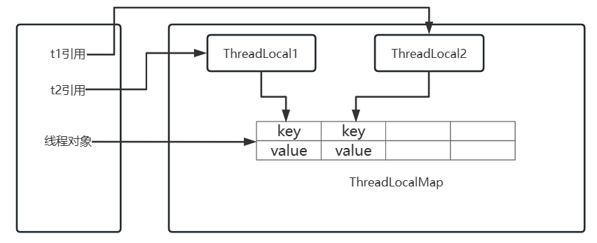

# 基础

## java中四种引用类型

- 强引用：`Object object= new Object()`，这种方式为强引用，强引用在任何时候都不会被 jvm 垃圾回收，即使抛出 OutOfMemoryError
- 软引用：通过`SoftReference`的get方法来获取对象。软引用，在jvm内存不足的情况下发生垃圾回收时会被回收
- 弱引用：通过`WeakReference`的get方法来获取对象。弱引用，只要发生垃圾回收都会回收该对象，不管内存是否充足
- 虚引用：虚引用和没有引用是一样的，需要和队列(ReferenceQueue)联合使用。当jvm扫描到虚引用对象时，会将此对象放入关联的引入队列中，后续可以通过判断队列中是否存这个对象，来进行回收前的一些处理


# 集合

# 线程

## 线程实现方式

1. 继承 Thread 类，重新 run 方法；启动线程时调用 Thread.start() 方法

   ```java
   /**
    * 实现 Thread ，重写 run 方法
    */
   private static void threadTest() {
       new Thread(){
           @Override
           public void run() {
               System.out.println(Thread.currentThread().getName());
           }
       }.start();
   }
   ```

2. 实现 Runnable 接口，重写 run 方法；将 Runnable 实现类对象传入 Thread 构造方法，然后调用 Thread.start() 启动线程

   ```java
   /**
    * 实现 Runnable 接口，并实现 run 方法
    * 创建 Thread 时传入 Runnable实现类实体
    */
   private static void runnableTest() {
       new Thread(new Runnable() {
           @Override
           public void run() {
               System.out.println(Thread.currentThread().getName());
           }
       }).start();
   }
   ```

3. 实现 Callable，重写 call 方法，配合 FutureTask ；一般用于有返回结果的非阻塞的执行方法

   ```java
   /**
    * 实现 Callable 接口，配合 FutureTask
    * 可以获取线程执行结果
    * Callable ===> FutureTask ===> Thread
    */
   private static void callableTest() throws Exception {
       Callable<String> callable = new Callable<>() {
           @Override
           public String call() {
               return Thread.currentThread().getName();
           }
       };
       FutureTask<String> futureTask = new FutureTask<>(callable);
       new Thread(futureTask).start();
       // 获取线程执行结果 ，超时时间
       System.out.println(futureTask.get(60, TimeUnit.SECONDS));
   }
   ```

线程实现方式，底层都是实现 Runnable 方式

## 线程状态

**操作系统层面讲**


- new（新建状态）：创建了一个新的线程对象
- runnable（就绪状态）：调用线程的start()方法，处于就绪状态
- run（运行状态）： 获得了CPU时间片，执行程序代码；`就绪状态是进入到运行状态的唯一入口`
- block（阻塞状态）：因为某种原因，线程放弃对CPU的使用权，停止执行，直到进入就绪状态在有可能再次被CPU调度；阻塞又分为三种：`等待阻塞`、`同步阻塞`、`其他阻塞`
- dead（死亡状态）：线程run()、main()方法执行结束，或者因为异常退出了run()方法，则该线程结束生命周期；`死亡状态线程不能再次复活`

**java 层面讲**

java 的线程状态可查看 jdk 的 `Thread.State` 枚举，其中包含了 6 种线程状态


- new（初始化）：新建一个 Thread 实例，就进入了初始化状态
- runnable（可运行）
  - ready：此时线程等待 cpu 调度，调用 start() 后进入就绪状态；当前线程 sleep() 方法结束，其他线程 join() 结束，等待用户输入完毕，某个线程拿到对象锁，线程也将进入就绪状态
  - running：cpu 调度该线程，这也是进入线程运行状态的唯一方法
- blocked：阻塞状态是线程阻塞在进入synchronized关键字修饰的方法或代码块(获取锁)时的状态
- waiting：处于这种状态的线程不会被分配CPU执行时间，它们要等待被显式地唤醒，否则会处于无限期等待的状态
- timed_waiting：处于这种状态的线程不会被分配CPU执行时间，不过无须无限期等待被其他线程显示地唤醒，在达到一定时间后它们会自动唤醒
- terminated：当线程的run()方法完成时，或者主线程的main()方法完成时，就认为它终止了；这个线程对象也许是活的，但是它已经不是一个单独执行的线程；`线程一旦终止了，就不能复生`；在一个终止的线程上调用start()方法，会抛出 java.lang.IllegalThreadStateException 异常

## java 中停止线程

使用 interrupt() 中断线程；如果线程在 等待状态时，调用  interrupt() 会抛出异常 InterruptedException

调用 interrupt() 不会立即终止线程，只是将 interrupted 标志设置为 true，需手动写逻辑终止线程

```java
public static void main(String[] args) {

    // 默认 interrupted 为 false
    System.out.println(Thread.currentThread().isInterrupted());  // false

    // 设置 interrupted 为 true
    Thread.currentThread().interrupt();

    // 这里直接跳过不执行，因为 interrupted 标志位为 true
    // isInterrupted() 方法获取当前 interrupted ，并重置 interrupted 为 false
    while (!Thread.currentThread().isInterrupted()){
        System.out.println("-------------");
    }
}
```

## sleep 和 wait 方法的区别

- sleep 方法属于 Thread 类的一个静态方法；wait 方法属于 Object 类的方法
- sleep 方法会使线程变成 `超时等待状态`（自动唤醒）；wait 方法会使线程变成`等待状态`（需要被唤醒）
- sleep 方法不会释放已经持有的锁资源；wait 在执行后会释放锁资源
- wait 只能在持有锁时才可以执行；sleep 没有这个限制

wait 方法会将持有锁的线程从 owner 扔到 WaitSet 集合中，这个操作是修改 ObjectMonitor 对象，如果没有持有 synchronized 锁的话，是没法操作 ObjectMonitor 对象的

## synchronized 实现原理

synchronized 基于对象实现


MarkWord 在 Hot Spot 中结构如下


MarkWord 标记着四种锁信息：无锁、偏向锁、轻量级锁、重量级锁

## synchronized 在 jdk 1.6 的优化

**锁消除：**在 synchronized 修饰的代码中，如果不存在操作临界资源的情况，会触发锁消除，即使写了 synchronized ，也不会触发

**锁膨胀：**如果在一个循环中，频繁的获取和释放锁资源，这样带来的消耗很大，锁膨胀就是将锁的范围扩大，避免频繁的竞争和获取锁资源带来的不必要消耗

**锁升级：**ReentrantLock 的实现，是基于乐观锁的 CAS 尝试获取锁资源，如果拿不到锁资源，才会挂起线程。synchronized 在 JDK 1.6 之前，完全就是获取不到锁，立即挂起当前线程，所以 synchronized 性能比较差，synchronized 就在 JDK 1.6 做了锁升级的优化

- 无锁、匿名偏向：当前对象没有作为锁存在
- 偏向锁：如果当前锁资源，只有一个线程在频繁的获取和释放，那么这个线程过来，只需要判断，当前指向的线程是否为当前线程
  - 如果是，直接拿走锁资源
  - 如果不是，基于 CAS 的方式，尝试将偏向锁指向当前线程。如果获取不到，触发锁升级，升级为轻量级锁（偏向锁状态出现了锁竞争的情况）
- 轻量级锁：会采用自旋锁的方式去频繁的以 CAS 的形式获取到锁资源（采用的是自适应自旋锁）
  - 如果成功获取到，拿着锁资源走
  - 如果自旋了一定次数，没有拿到锁资源，锁升级
- 重量级锁：就是最传统的 synchronized 方式，拿不到锁资源，就挂起当前线程（用户态 & 内核态）

## ReentrantLock 和 synchronized

- ReentrantLock 是个类，synchronized 是关键字，都是在 JVM 层面实现互斥锁的方式
- 如果竞争比较激烈，推荐使用 ReentrantLock 去实现，不存在锁升级概念。而 synchronized 是存在锁升级概念的，如果升级到重量级锁，是不存在锁降级的
- 实现原理不一样，ReentrantLock 基于 AQS 实现的，synchronized 基于 ObjectMonitor 实现的
- ReentrantLock 功能比 synchronized 更全面；ReentrantLock 支持公平锁或非公平锁；ReentrantLock 可以指定等待锁资源的时间

## ThreadLocal 内存泄漏问题

**ThreadLocal 实现原理**

- 每个 Thread 中都存储着一个成员变量，ThreadLocalMap
- ThreadLocal 本身不存储数据，像是一个工具类，基于 ThreadLocal 去操作 ThreadLocalMap
- ThreadLocalMap 本身就是基于 Entry[] 实现的，因为一个线程可以绑定多个 ThreadLocal，这样一来可能需要存储多个数据，所以采用 Entry[] 的形式实现
- 每一个线程都有自己独立的 ThreadLocalMap ，再基于 ThreadLocal 对象本身作为 key，对 value进行存取
- ThreadLocalMap 的 key 是一个弱引用，弱引用的特点是，即便有弱引用在 GC 时也会被垃圾回收。这里是为了在 ThreadLocal 对象失去引用后，如果 key 的引用是强引用，会导致 ThreadLocal 对象无法被回收

**内存泄漏**

- key 的内存泄漏：ThreadLocalMap key 是弱引用 ThreadLocal 对象，解决了

- value 内存泄漏：如果 ThreadLocal 引用丢失，key 因为弱引用会被 GC 回收掉，如果同时线程还没有被回收，就会导致内存泄漏，内存中的 value 无法被回收，同时也无法被获取到；只需要在使用完毕 ThreadLocal 对象后，及时的调用 remove 方法，移除 Entry 即可



## java 中锁分类

1. 可重入锁、不可重入锁

   java 提供的 synchronized、ReentrantLock、ReentrantReadWriteLock 都是可重入锁

   **重入：**当线程获取到 A 锁，在获取之后尝试再次获取 A 锁是可以直接拿到的

   **不可重入：**当线程获取到 A 锁，在获取后再次尝试获取 A 锁，无法获取到，因为 A 锁被当前线程占用着，需要等待自己释放锁再获取锁

2. 乐观锁、悲观锁

   java 提供的 synchronized、ReentranLock、ReentranReadWriteLock 都是悲观锁

   java 中 CAS 操作就是乐观锁的一种实现

   **悲观锁：**在获取不到锁资源时，会将线程挂起（进入 BLOCKED、WAITING），线程挂起会涉及到用户态和内存态的切换，而这种切换比较耗资源

   - 用户态：JVM 可以自行执行的指令，不需要借助操作系统执行
   - 内核态：JVM 不可以自行执行，需要操作系统才可以执行

   **乐观锁：**获取不到锁资源，可以再次让 CPU 调度，重新尝试获取锁资源

   Atomic 原子性类中，就是基于 CAS 乐观锁实现的

3. 公平锁、非公平锁

   java 提供的 synchronized 只能是非公平锁

   java 提供的 ReentrantLock、ReentranReadWriteLock 可以实现公平锁和非公平锁

   **公平锁：**线程 A 获取到了锁资源，线程 B 没有拿到，线程 B 去排队，线程 C 来了，锁被 A 持有，同时 B 在排队。C 排在 B 后面，直到 B 拿到锁资源或者 B 取消后，才可以尝试去竞争锁

   **非公平锁：**线程 A 获取到了锁资源，线程 B 没有拿到，线程 B 去排队，线程 C 来了，先尝试竞争一波

   - 拿到锁资源：插队成功
   - 没有拿到锁资源：依然需要排队在 B 的后面，等待 B 拿到锁资源或 B 取消后，才可以尝试竞争锁

4. 互斥锁、共享锁

   java 提供的 synchonized、ReentrantLocak 是互斥锁

   java 提供的 ReentrantReadWriteLock 有互斥锁也有共享锁

   **互斥锁：**同一时间点，只会有一个线程持有当前互斥锁

   **共享锁：**同一时间点，当前共享锁可以被多个线程同时持有

## 并发编程的三大特性

**原子性**

原子性指的是一个操作是不可分割的，不可中断的，一个线程在执行时，另外一个线程不会影响到他

可以通过 synchronized、CAS、Lock 锁、ThreadLocal 来保证并发编程的原子性

**可见性**

cpu 执行过程会存在缓存，需要保证所有线程读取到的数据是一致的

使用 synchroized 、 lock 都会在加锁和释放锁时对 cpu 缓存做一个同步到主内存的操作，如果在同步代码块中没有对数据进行修改，也能保证可见性

使用 volatile 来保证可见性

- volatile 属性被写时，JMM 会将当前线程对应的 cpu 缓存及时刷新到主内存中
- volatile 属性被读时，JMM 会将对应的 CPU 缓存中的内存设置为无效，必须从主内存中重新读取共享变量

**有序性**

在 java 中，java 文件中的内容会被编译，在执行前需要再次转为 CPU 可识别的指令，CPU 在执行这些指令时，为了提升执行效率，在不影响最终结果的前提下（满足某种要求），会对指令进行重排

可以使用 volatile 可以保证有序性，防止指令重排

## JDK 中提供的线程池

**newFixedThreadPool**

这个线程池的线程是固定的 `Executors.newFixedThreadPool(int nThreads)`

```java
// 无界队列，线程核心数量和最大数量一致；线程空闲超过 0s 后关闭 （大于核心线程数的线程）
public static ExecutorService newFixedThreadPool(int nThreads) {
    return new ThreadPoolExecutor(nThreads, nThreads,
                                  0L, TimeUnit.MILLISECONDS,
                                  new LinkedBlockingQueue<Runnable>());
}
```

构建该线程池时需要提供一个 nThreads 的属性，这个属性就是线程池中线程的个数（线程是懒加载，构建线程池时并没有创建线程，当任务提交时才会在线程池中构建线程）；任务会被添加到无界队列 LinkedBlockingQueue 中等待线程去 take() 出后执行

**newSingleThreadExecutor**

```java
// 无界队列，线程核心数量和最大数量一致且为1；线程空闲超过 0s 后关闭 （大于核心线程数的线程）
public static ExecutorService newSingleThreadExecutor() {
    // FinalizableDelegatedExecutorService 里面只是在 finalize 中去关闭了一次线程池（无意义）
    return new FinalizableDelegatedExecutorService
        (new ThreadPoolExecutor(1, 1,
                                0L, TimeUnit.MILLISECONDS,
                                new LinkedBlockingQueue<Runnable>()));
}
```

单例线程池，线程池中只有一个工作线程在运行

任务执行顺序及任务进入无界队列的顺序，可用来处理 顺序处理的业务

**newCachedThreadPool**

```java
// 线程核心数量为0，最大为 Integer.MAX_VALUE；
// 线程空闲超过 60s 后关闭 （大于核心线程数的线程）
public static ExecutorService newCachedThreadPool() {
    return new ThreadPoolExecutor(0, Integer.MAX_VALUE,
                                  60L, TimeUnit.SECONDS,
                                  new SynchronousQueue<Runnable>());
}
```

第一次提交任务到线程池时，会直接创建一个工作线程；当工作线程执行完后，60s内没有任务，会结束这个工作线程

如果后续进来任务没有线程时，会创建新的工作线程去执行

特点：当任务提交到该线程池中时，必然会有工作线程进行处理

**ScheduledExecutorService**

```java
public static ScheduledExecutorService newScheduledThreadPool(int corePoolSize) {
    return new ScheduledThreadPoolExecutor(corePoolSize);
}
```

定时任务线程池，这个线程池可以一定周期去执行一个任务，或者延迟多久执行一个任务

**newWorkStealingPool**

```java
public static ExecutorService newWorkStealingPool() {
    return new ForkJoinPool
        (Runtime.getRuntime().availableProcessors(),
         ForkJoinPool.defaultForkJoinWorkerThreadFactory,
         null, true);
}
```

该线程池和前面几种区别很大

前面的线程池底层都是基于 `ThreadPoolExecutor` 构建的；newWorkStealingPool 线程池是基于 ForkJoinPool 构建出来的

## 线程池核心参数

ThreadPoolExecutor 有 7 个核心参数

```java
public ThreadPoolExecutor(int corePoolSize,   // 核心线程数量，始终存活
                          int maximumPoolSize,  // 任务超过核心线程数量时，可创建的最大线程数量
                          long keepAliveTime,  // 超过 corePoolSize 的线程数量空闲时存活时间
                          TimeUnit unit,  // 存活时间单位
                          BlockingQueue<Runnable> workQueue,  // 任务队列，存放当前没有线程处理的任务
                          ThreadFactory threadFactory,  // 构建线程，可以设置线程的一些参数
                          RejectedExecutionHandler handler  // 拒绝策略，线程池无法处理任务时
) {
```

**拒绝策略**

- ThreadPoolExecutor.AbortPolicy：抛出错误 RejectedExecutionException
- ThreadPoolExecutor.CallerRunsPolicy：使用调用者线程执行任务，直接调用任务的 run 方法
- ThreadPoolExecutor.DiscardPolicy：丢弃任务
- ThreadPoolExecutor.DiscardOldestPolicy：丢弃最早的未处理任务

## 线程池状态

线程池核心属性是 ctl，基于 ctl 拿到线程池的状态以及工作线程个数

```java
// ctl 是一个 int 类型的数值，内部基于 AtomicInteger 嵌套了一层，保证操作的原子性
// 线程池状态：ctl 高三位表示线程池状态
// 工作线程个数：ctl 低三位表示线程的个数
private final AtomicInteger ctl = new AtomicInteger(ctlOf(RUNNING, 0));

// Integer.SIZE 获取 Integer 的 bit 个数
// 申明一个常量 COUNT_BITS = 29
private static final int COUNT_BITS = Integer.SIZE - 3;
// COUNT_MASK 为当前线程池记录的工作线程个数
private static final int COUNT_MASK = (1 << COUNT_BITS) - 1;

// 线程池状态
// 111：线程池正常，可接收任务处理
private static final int RUNNING    = -1 << COUNT_BITS;
// 000：线程池关闭状态，不会接受新任务，正在处理的任务正常执行，阻塞队列中任务也会执行
private static final int SHUTDOWN   =  0 << COUNT_BITS;
// 001：线程池停止状态，不接收新任务，当前线程池中任务和阻塞队列中任务全都不管
private static final int STOP       =  1 << COUNT_BITS;
// 010：线程池整理，从 STOP 或 SHTUDOWN 转换过来的，只是一个过渡状态，代表当前线程池立马关闭
private static final int TIDYING    =  2 << COUNT_BITS;
// 001：线程池结束，从 TIDYING 转换过来的，转换过来只需要执行一个 terminated 方法
private static final int TERMINATED =  3 << COUNT_BITS;
```


## @Contended 注解作用

使用@Contended来保证被标识的字段或者类不与其他字段出现内存争用


为了提高IO效率，CPU每次从内存读取数据并不是只读取我们需要计算的数据，而是将我们需要的数据周围的64个字节（intel处理器的缓存行是64字节）的数据一次性全部读取到缓存中。这64个字节的数据就称为一个**缓存行**

假设现在有两个线程都需要缓存行1（见图）中的数据做运算，假设CPU1需要缓存行1中的第一个字节数据做运算，CPU2需要缓存行1中的第二个字节做运算。此时CPU1和CPU2都需要将缓存行1读取到缓存中，这样就有可能出现缓存不一致现象，为了保证缓存一致性，出现了很多种的缓存一致性协议，其中intel使用了MESI协议来保证缓存一致性。

@Contended 注解作用就是让数据独占一个缓存行，可以提升运行效率

```java
/**
 * \@Contended 注解的作用
 * 使用@Contended来保证被标识的字段或者类不与其他字段出现内存争用
 * 为了提高IO效率，CPU每次从内存读取数据并不是只读取我们需要计算的数据，
 * 而是将我们需要的数据周围的64个字节（intel处理器的缓存行是64字节）的数据一次性全部读取到缓存中。这64个字节的数据就称为一个缓存行。
 * 假设现在有两个线程都需要缓存行1中的数据做运算，假设CPU1需要缓存行1中的第一个字节数据做运算，CPU2需要缓存行1中的第二个字节做运算。
 * 此时CPU1和CPU2都需要将缓存行1读取到缓存中，这样就有可能出现缓存不一致现象，为了保证缓存一致性，出现了很多种的缓存一致性协议，其中intel使用了MESI协议来保证缓存一致性。
 * 简单的说，当CPU1对缓存行1中的数据做了修改时，会通知CPU2，告诉他数据我修改了，你那边作废了，需要重新从内存读取。反之，CPU2对数据做出修改，CPU1也需要重新读取。这样就会导致大量的IO操作，导致性能降低。
 * <p>
 * 为了避免这种现象，我们需要想办法将这两个数据放到不同的缓存行中，这样就可以避免频繁的读取数据，增加性能。
 * <p>
 * 注意：如果想要@Contended注解起作用，需要在启动时添加JVM参数
 *
 * @author 81497
 * @date 2023/06/10
 */
public class ContendedDemo {
    // volatile 使用内存屏障保证数据的可见性 （更新直接写主存、读取从主从读）
    @Contended
    public volatile long x;
    public volatile long y;

    public static void main(String[] args) throws InterruptedException {
        testNoContended();

    }

    /**
     * 定义了两个变量x和y，并且使用两个线程对这两个变量做赋值操作。
     * 如果不加@Contended注解，x和y有很大概率位于同一个缓存行。
     * 就会出现我们刚才所说的频繁的重新从内存读取数据。如果对x变量添加了@Contended注解，则可以保证x与y在不同的缓存行
     * 不加 @Contended 注解执行时间：1261ms 左右波动；添加 @Contended 注解执行时间 385ms 左右波动，效率提升三倍左右
     */
    private static void testNoContended() throws InterruptedException {
        ContendedDemo contendedDemo = new ContendedDemo();
        Thread t1 = new Thread(() -> {
            for (long i = 0; i < 1000000000L; i++) {
                contendedDemo.x = i;
            }
        });
        Thread t2 = new Thread(() -> {
            for (long i = 0; i < 1000000000L; i++) {
                contendedDemo.y = i;
            }
        });
        long millis = System.currentTimeMillis();
        t1.start();
        t2.start();
        t1.join();
        t2.join();
        System.out.println((System.currentTimeMillis()-millis)+"ms");
    }
}
```


## 什么是 CAS

CAS(compare and swap)：也就是比较和交换，它是一条 CPU 的并发原语

它包含了三个参数：V，A，B。其中，V表示要读写的内存位置，A表示旧的预期值，B表示新值

它在替换内存某个位置的值时，首先查看内存中的值和预期值是否一致，如果一致，执行替换操作，这个操作是一个原子性操作

Java 中基于 Unsafe 的类提供了对 CAS 操作的方法，JVM 会帮助我们将方法实现 CAS 汇编指令

**优点**

比较传统的 synchroized 可以避免线程的挂起以及唤醒，避免了用户态内核态切换的时间成本

**缺点**

自旋时间可能过长，CPU开销较大

## 哲学家就餐问题

**描述：**哲学家就餐问题是计算机科学中一经典问题，用于演示并行计算中多线程同步（Synchronization）问题

**如下图：**假设有五位哲学家围坐在一张圆形餐桌旁，做以下两件事情之一：吃饭，或者思考。吃东西的时候，他们就停止思考，思考的时候也停止吃东西。餐桌中间有一大碗意大利面，每两个哲学家之间有一只餐叉，假设哲学家必须用两只餐叉吃东西。他们只能使用自己左右手边的那两只餐叉


**代码实现**

```java
/**
 * 哲学家就餐
 * 假设有五位哲学家围坐在一张圆形餐桌旁，做以下两件事情之一：吃饭，或者思考。吃东西的时候，他们就停止思考，思考的时候也停止吃东西。
 * 餐桌中间有一大碗意大利面，每两个哲学家之间有一只餐叉，假设哲学家必须用两只餐叉吃东西。他们只能使用自己左右手边的那两只餐叉
 *
 * @author 81497
 * @date 2023/06/05
 */
public class DiningPhilosophers {

    public static void main(String[] args) {
        // 筷子
        Fork f0 = new Fork("f0");
        Fork f1 = new Fork("f1");
        Fork f2 = new Fork("f2");
        Fork f3 = new Fork("f3");

        // 哲学家
        DiningPeople d1 = new DiningPeople(f0, f1, 1);
        DiningPeople d2 = new DiningPeople(f1, f2, 2);
        DiningPeople d3 = new DiningPeople(f2, f3, 3);
        DiningPeople d4 = new DiningPeople(f3, f0, 4);

        new Thread(d1).start();
        new Thread(d2).start();
        new Thread(d3).start();
        new Thread(d4).start();
    }

    /**
     * 哲学家
     */
    public static class DiningPeople extends Thread {
        private final Fork left, right;
        private final int index;

        public DiningPeople(Fork left, Fork right, int index) {
            this.left = left;
            this.right = right;
            this.index = index;
        }

        /**
         * 规定奇数号哲学家先拿他左边的筷子，然后在去拿右边的筷子；而偶数号哲学家则相反。按此规定，将是1、2号哲学家竞争1号筷子；3、4号哲学家竞争3号筷子。
         * 即5位哲学家都先竞争奇数号筷子，获得后，再去竞争偶数号筷子，最后总会有一位哲学家能够获得两只筷子而进餐
         */
        @Override
        public void run() {
            try {
                while (true) {
                    if (index % 2 == 0) {
                        // 拿到左手筷子
                        synchronized (left) {
                            System.out.println(index + "拿到左手筷子");
                            // 拿到右手筷子
                            synchronized (right) {
                                System.out.println(index + "哲学家开始吃饭");
                                TimeUnit.MILLISECONDS.sleep(1000);
                            }
                        }
                    } else {
                        // 拿到左手筷子
                        synchronized (right) {
                            System.out.println(index + "拿到右手筷子");
                            // 拿到右手筷子
                            synchronized (left) {
                                System.out.println(index + "哲学家开始吃饭");
                                TimeUnit.MILLISECONDS.sleep(1000);
                            }
                        }
                    }
                    System.out.println(index + "哲学家吃饭结束");
                    TimeUnit.MILLISECONDS.sleep(1000);

                }
            } catch (Exception e) {
                e.printStackTrace();
            }
        }
    }

    /**
     * 叉
     */
    public static class Fork {
        private String name;

        public Fork(String name) {
            this.name = name;
        }
    }
}
```

## 多线程事务控制

- 创建子线程个数的 CountDownLatch 

- 创建主线程 CountDownLatch 
- 共享数据，里面设置回滚标志

```java
/**
 * 多个任务，同时成功或失败
 *
 * @author 81497
 * @date 2023/06/06
 */
public class TransactionIssues {

    public static void main(String[] args) {
        // 主线程监控
        CountDownLatch mainLatch = new CountDownLatch(1);
        // 子线程监控
        CountDownLatch threadLatch = new CountDownLatch(4);
        ShareData shareData = new ShareData(mainLatch, threadLatch);

        // 启动四个子线程
        new Work(shareData).start();
        new Work(shareData).start();
        new Work(shareData).start();
        new Work(shareData).start();

        try {
            // 等待子线程结束，超时未结束会返回 false
            if (!threadLatch.await(10, TimeUnit.SECONDS)) {
                // 等待超时 设置共享变量为回滚
                shareData.rollback = true;
            }
        } catch (InterruptedException e) {
            // 当前线程被中断
            shareData.rollback = true;
        } finally {
            System.out.println("主线程处理结束");
            mainLatch.countDown();
        }

    }

    /**
     * 线程之间共享数据
     */
    public static class ShareData {
        public ShareData(CountDownLatch mainLatch, CountDownLatch threadLatch) {
            this.mainLatch = mainLatch;
            this.threadLatch = threadLatch;
        }

        CountDownLatch mainLatch;
        CountDownLatch threadLatch;
        volatile boolean rollback;
    }


    public static class Work extends Thread {
        private final ShareData shareData;

        public Work(ShareData shareData) {
            this.shareData = shareData;
        }

        @Override
        public void run() {
            try {
                // 模拟业务执行时间
                TimeUnit.MILLISECONDS.sleep(1000);
                if ("Thread-0".equals(Thread.currentThread().getName())) {
                    throw new IllegalArgumentException("异常");
                }
            } catch (Exception e) {
                // 业务执行失败，设置回滚
                System.out.println("子线程业务执行异常");
                shareData.rollback = true;
            } finally {
                // 当前子线程执行结束
                System.out.println(Thread.currentThread().getName() + "业务处理结束");
                shareData.threadLatch.countDown();
            }

            try {
                // 等待主线程处理结束，这里不设置超时时间
                shareData.mainLatch.await();
            } catch (InterruptedException e) {
                // 等待超时，默认处理直接回滚数据
                rollback();
            }
            if (shareData.rollback) {
                rollback();
            }
            System.out.println(Thread.currentThread().getName() + "子线程处理结束");
        }

        private void rollback() {
            System.out.println(Thread.currentThread().getName() + "回滚");
            throw new RuntimeException(Thread.currentThread().getName() + "子线程回滚");
            // 回滚失败可记录日志表
        }

    }
}
```

## 交替输出问题

假设有两个线程 A、B，A 输出的是 123456 ，B 输出的是 ABCDEF，需要保证最终输出为：1A2B3C4D5E6F 交替输出

> 通过 LockSupport.park() 和 LockSupport.unpark() 实现；park 和 unpark 顺序无所谓，内部有一个标识（类似于 +1 -1 操作，只要标识正确就可以）

```java
/**
 * 交替输出
 *
 * @author 81497
 * @date 2023/06/06
 */
public class AlternatingOutput {
    private static Thread t1, t2;

    public static void main(String[] args) {
        char[] a = "123456".toCharArray();
        char[] b = "ABCDEF".toCharArray();

        t1 = new Thread(() -> {
            for (char c : a) {
                System.out.print(c);
                // 唤醒 t2 线程
                LockSupport.unpark(t2);
                // 停止当前线程
                LockSupport.park();

            }
        });
        t2 = new Thread(() -> {
            for (char c : b) {
                // 停止当前线程
                LockSupport.park();
                System.out.print(c);
                // 唤醒 t1 线程
                LockSupport.unpark(t1);
            }
        });
        // 启动线程
        t1.start();
        t2.start();
    }
}
```

> 利用锁实现

```java
/**
 * 交替输出
 * 假设有两个线程 A、B，A 输出的是 123456 ，B 输出的是 ABCDEF，需要保证最终输出为：1A2B3C4D5E6F 交替输出
 *
 * @author 81497
 * @date 2023/06/06
 */
public class AlternatingOutput {
    private static Thread t1, t2;
    static final char[] a = "123456".toCharArray();
    static final char[] b = "ABCDEF".toCharArray();
    // 保证执行顺序，先执行 t2 线程，再执行t1线程
    static CountDownLatch downLatch = new CountDownLatch(1);

    /**
     * 利用锁实现
     */
    private static void test2() {
        t1 = new Thread(() -> {
            // 执行后等待门栓
            try {
                downLatch.await();
            } catch (InterruptedException e) {
                throw new RuntimeException(e);
            }

            synchronized (AlternatingOutput.class) {
                for (char c : a) {
                    try {
                        // 唤醒阻塞线程
                        System.out.print(c);
                        AlternatingOutput.class.notify();
                        AlternatingOutput.class.wait();
                    } catch (InterruptedException e) {
                        Thread.currentThread().interrupt();
                        throw new RuntimeException(e);
                    }

                }
                // 最后需要释放锁，不然总有个线程在等待，程序不能结束
                AlternatingOutput.class.notify();
            }
        });
        t2 = new Thread(() -> {
            synchronized (AlternatingOutput.class) {
                // 获取锁后就可以，关闭门闩
                downLatch.countDown();
                for (char c : b) {
                    try {
                        System.out.print(c);
                        AlternatingOutput.class.notify();
                        AlternatingOutput.class.wait();
                    } catch (InterruptedException e) {
                        Thread.currentThread().interrupt();
                        throw new RuntimeException(e);

                    }
                }
                // 最后需要释放锁，不然总有个线程在等待，程序不能结束
                AlternatingOutput.class.notify();
            }
        });
        // 启动线程
        t1.start();
        t2.start();
    }
}
```


# Spring

## 对 Spring 理解

**发展历程**

Spring 在 `2004-03-24` 发布了 1.0 的版本，截止到 2023 年，Spring 已经发布了 6.x 的版本，主要使用版本为 Spring5.x 版本

**Spring 组成**

Spring 是一个轻量级的 IOC 和 AOP 容器框架。是为 Java 程序提供基础性服务的一套框架，目的是用于简化企业应用程序的开发，它使得开发者只需要关心业务需求。常见的配置方式有三种：基于 XML 的配置、基于注解的配置、基于 Java 的配置

主要由以下几个模块组成

- Spring Core：核心类库，提供 IOC 服务
- Spring Context：提供框架式的 Bean 访问方式，以及企业级功能（JNDI、定时任务等）
- Spring AOP：AOP服务
- Spring DAO：对 JDBC 的抽象，简化数据访问异常的处理
- Spring ORM：对现有的 ORM 框架的支持
- Spring Web：提供了基本的面向 Web 的综合特性，例如多文件上传
- Spring MVC：提供面向 Web 应用的 Model-View-Controller 实现

**Spring 好处**

| 序号 |       好处        | 说明                                                         |
| :--: | :---------------: | ------------------------------------------------------------ |
|  1   |       轻量        | Spring 是轻量的，基本版本大约 2MB                            |
|  2   |     控制反转      | Spring 通过控制反转实现了松散耦合                            |
|  3   | 面向切面编程(AOP) | Spring 支持面向切面的编程，并把应用业务逻辑和系统服务分开    |
|  4   |       容器        | Spring 包含并管理应用中对象的生命周期和配置                  |
|  5   |     MVC 框架      | Spring 的 WEB 框架是个精心设计的框架，是 WEB 框架的一个很好替代品 |
|  6   |     事务管理      | Spring 提供了一个持续的事务管理接口，可以扩展到上至本地事务下至全局事务（JTA） |
|  7   |     异常处理      | Spring 提供方便的 API 把具体的技术相关异常转化为一个 unchecked 异常 |
|  8   |      最重要       | 使用的人多，生态丰富                                         |

## Spring 中用到的设计模式

**单例模式**

通过 xml 配置 bean 时，默认为单例

```xml
<?xml version="1.0" encoding="UTF-8"?>
<beans xmlns="http://www.springframework.org/schema/beans"
       xmlns:xsi="http://www.w3.org/2001/XMLSchema-instance"
       xsi:schemaLocation="http://www.springframework.org/schema/beans
        https://www.springframework.org/schema/beans/spring-beans.xsd">
    <!--  默认 scope 为 singleton 单例 -->
    <bean id="helloService" class="org.lei.ch01.service.HelloService">
        <property name="name" value="小唐"/>
    </bean>
</beans>
```

**原型模式**

通过 xml 配置 bean 时，可以声明 bean 为原型模式

```xml
<?xml version="1.0" encoding="UTF-8"?>
<beans xmlns="http://www.springframework.org/schema/beans"
       xmlns:xsi="http://www.w3.org/2001/XMLSchema-instance"
       xsi:schemaLocation="http://www.springframework.org/schema/beans
        https://www.springframework.org/schema/beans/spring-beans.xsd">
    <!--  声明 bean，声明 scope 为原型模式 -->
    <bean id="helloService" class="org.lei.ch01.service.HelloService" scope="prototype">
        <property name="name" value="小唐"/>
    </bean>
</beans>
```

**模板模式**

模板模式的核心是父类定义好流程，然后将流程中需要子类实现的方法就抽象给子类实现。Spring 中的 JdbcTemplate 就是这样实现的

JDBC 的固定步骤

1. 加载驱动
2. 获取连接通道
3. 构建 sql 执行语句
4. 执行 sql 语句
5. 关闭资源

在这些步骤中，第3步和第4步是不确定的，所以留给客户实现，而实际使用 jdbcTemplate 的时候也确实只需要构建 SQL 语句就行了。这就是典型的`模板模式`

**观察者模式**

观察者模式定义的是对象之间一种`一对多的依赖关系`，当一个对象的状态发生改变时，所有依赖它的对象都得到通知并被自动更新。ApplicationListener 就使用到了观察者模式

**工厂模式**

简单工厂模式：简单工厂模式就是通过工厂根据传递进来的参数决定产生哪个对象，Spring 中我们通过 id 或 name 调用getBean 方法获取对象就是简单工厂模式

工厂方法模式：在 Spring 中我们一般是将 Bean 实例化直接交给容器去管理的，实现了使用和创建的分离，这时容器直接管理对象；还有种情况是，bean 的创建过程交给一个工厂去实现，而 Spring 容器管理这个工厂；在 Spring 中有两种工厂方法模式，一种是静态工厂方法模式，一种是动态工厂方法模式

**适配器模式**

将一个类的接口转换成客户希望的另一个接口。使得原本由于接口不兼容而不能在一起工作的那些类可以在一起工作，这就是适配器模式。在 Spring 中在 AOP 实现中的 Advice 和 interceptor 之间的转换就是通过适配器模式实现的

```java
class MethodBeforeAdviceAdapter implements AdvisorAdapter, Serializable {
    MethodBeforeAdviceAdapter() {
    }

    public boolean supportsAdvice(Advice advice) {
        return advice instanceof MethodBeforeAdvice;
    }

    public MethodInterceptor getInterceptor(Advisor advisor) {
        MethodBeforeAdvice advice = (MethodBeforeAdvice)advisor.getAdvice();
        // 通知类型匹配对应的拦截器
        return new MethodBeforeAdviceInterceptor(advice);
    }
}
```

**装饰者模式**

装饰者模式又称为包装模式（Wrapper），作用是用来动态的为一个对象增加新的功能。装饰模式是一种用于代替继承的技术，无须通过继承增加子类就能扩展对象的新功能。使用对象的关联关系替代继承关系，更加灵活，同时避免类型体系的快速膨胀

Spring 中用得到包装模式在类名上有两种表现：一种是类名中含有 Wrapper，另一种是类名含有 Decorator。基本上都是都是动态的给一个对象添加一些额外的职责

具体的使用在 SpringSession 框架中的 SessionRepositoryRequestWrapper 使用包装模式对原生的 request 的功能进行增强，可以将 session 中的数据和分布式数据库同步，这样即使当前 tomcat 崩溃，session 中的数据也不会丢失

**代理模式**

aop 就是基于代理模式

**策略模式**

策略模式对应于解决某个问题的的算法族，允许用户任选一个算法解决某个问题，同时可以方柏霓的更换或者增加新的算法。spring 中在实例化对象时会用到 策略模式，XmlBeanDefinitionReader，PropertiesBeanDefinitionReader

**责任链模式**

AOP 中的拦截器链

**委托者模式**

DelegatingFilterProxy，整合 Shiro、SpringSecurity 的时候都有用到

## @Autowired 和 @Resource

@Autowired 和 @Resource 都是做 bean 的注入时使用，@Resource 并不是 Spring 的注解，它的包是 javax.annotation.Resource，需要导入，但是 Spring 支持该注解的注入

**共同点**

两者都可以使用在`字段和setter方法`上。两者如果都写在字段上，那么久不需要再写 setter 方法

**不同点**

@Autowired 为 Spring 提供的注解，需要导入 org.springframework.beans.factory.annotation.Autowired ，只按照 byType 注入；@Autowired 注解是按照类型（byType）装配依赖对象，默认情况下它会要求依赖对象必须存在，可以设置它的 required 属性为 false。如果想按照名称（byName）注入，可以配合 @Qualififier 注解一起使用

@Resource 默认是按照名字自动注入（byName），由 J2EE 提供，需要导入包 Java.annotation.Resource。@Resource 有两个重要的属性：name 和 type，而 Spring 将 @Resource 注解的 name 属性解析为 bean 的名字，而 type 属性则解析为 bean 的类型。所以使用 name 属性，则使用 byName 的自动注入策略，而使用 type 属性则使用 byType 自动注入策略。如果既不指定 name 属性也不指定 type 属性，这时将通过反射机制使用 byName 自动注入策略

@Resource 装配顺序

1. 如果同时指定了 name 和 type，则从 Spring 上下文找到唯一匹配的 bean 进行装配，找不到则抛出异常
2. 如果指定了 name，则从上下文查找名称（id）匹配的 bean 进行装配，找不到则抛出异常
3. 如果指定 type，则从上下文找到类似匹配的唯一 bean 进行装配，找不到或是找到多个，都会抛出异常
4. 如果 name 和 type 属性都没指定，则自动按照 byName 进行装配；如果没有匹配，则回退为一个原始类型进行匹配，如果匹配了则自动装配

## Spring 中循环依赖

**循环依赖几种情况**


上图是循环依赖的三种情况，虽然方式不一样，但是循环依赖本质都是一样的，就是我完成创建要依赖的对象也依赖自己，相互依赖从而没法创建造成失败

**代码演示**

```java
public class Main {

    public static void main(String[] args) {
        A a = new A();
    }

    static class A{
        B b=new B();
    }
    static class B{
        A a=new A();
    }

}
```

**解决方法本质**

先创建 A ，但是不进行初始化操作，也就是半成品对象，然后在创建 B 的时候先把 A 暴露出来，让 B 创建完成后找到 A 通过 set 方法设置 A 的属性，完成整体的实例化

**Spring 解决循环依赖**


**三级缓存**


# JVM

# 分布式


