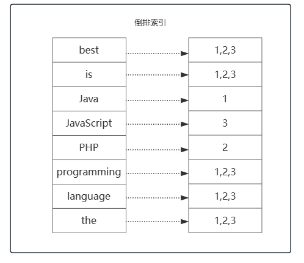
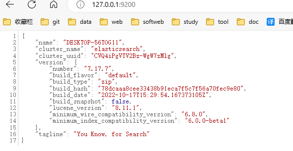

# 一些概念

## Elastic Stack核心

The Elastic Stack 包括 Elasticsearch、Kibana、Beats 和 Logstash（也称为 ELK Stack）。Elasticsearch 简称 ES，ES 是一个`开源的高扩展的分布式全文搜索引擎`，是整个 Elastic Stack 技术栈的核心。它可以近乎实时的存储、检索数据。本身扩展性很好。可以扩展到上百台服务器，处理 PB 级别的数据。

## 核心定义

Elasticsearch 是面向文档型数据库，一条数据就是一个文档。


ES 6.0之前 Index 可以看作是一个库，而 Types 相当于表，Documents 则相当于表的行。`不过 Types 的概念已经逐渐弱化，在 ES6.X 中，一个 Index 下已经只能包含一个 Type，在 ES7.X 中，Type的概念已经被移除了`

## RESTful

- GET：非幂等性
- POST：非幂等性
- PUT：幂等性
- DELETE：幂等性

## 数据分类

**数据大致可分为两类**

- 结构化数据：也称作行数据，是由二维表结构来逻辑表达和实现的数据，严格地遵循数据格式与长度规范，主要通过关系型数据库进行存储和管理。如MySQL、PGSQL 等
- 非结构化数据：又可称为全文数据，不定长或无固定格式，不适于由数据库二维表来表现，包括所有格式的办公文档、XML、HTML、Word、日志等，主要通过 NOSQL 存储管理。如 MongoDB、redis、Elasticserach等

非结构化数据更细致划分可以划分出`半结构化数据`。XML、HTML 可划分为半结构化数据，因为它们也具有自己特定的标签格式，所以既可以根据需要按结构化数据来处理，也可抽取出纯文本按非结构化数据来处理。

**对于两种类型的数据，搜索也可分为两种**

- 结构化数据搜索：因为它们具有特定的结构，所以我们一般都是可以通过关系型数据库（MySQL，Oracle 等）的二维表（Table）的方式存储和搜索，也可以建立索引
- 非结构化数据搜索：对于非结构化数据搜索，可以分为两种方法
  1. 顺序扫描：通过文字名称也可了解到它的大概搜索方式，即按照顺序扫描的方式查询特定的关键字
  2. 全文检索：将非结构化数据中的一部分信息提取出来，重新组织，使其变得有一定结构，然后对此有一定结构的数据进行搜索

## 倒排索引

- 正排索引：以 id 为索引检索数据内容
- 倒排索引：以数据内容为索引，检索 id

倒排索引为了创建倒排索引会对内容进行分词，通过分词器将每个文档的内容域拆分成单独的词（词条或 Term），创建一个包含所有不重复词条的排序列表，然后列出每个词条出现在哪个文档

例如：

存在数据如下

```tex
1 Java is the best programming language.
2 PHP is the best programming language.
3 Javascript is the best programming language.
```



# ES 基本使用

请求路径省略`127.0.0.1:9200`

## 安装

1. 从官网下载 [Elasticsearch：官方分布式搜索和分析引擎 | Elastic](https://www.elastic.co/cn/elasticsearch/)

   ```tex
   elasticsearch-7.17.7
   	--bin 		可执行文件
   	--config	配置文件
   	--jdk		jdk运行环境
   	--lib		类库（jar）
   	--logs		
   	--modules
   	--plugins	插件
   ```

2. 进入bin目录，点击`elasticsearch.bat`启动 Elasticsearch

   默认9300端口：集群间组件的通信端口

   默认9200端口：浏览器访问 http 协议的 RESTful 端口

3. 打开浏览器，输入地址 [127.0.0.1:9200](http://127.0.0.1:9200/)

   

## 基础操作

1. 创建索引 shopping：`PUT /shopping`

2. 获取 shopping 索引信息：`GET /shopping`

3. 获取所有索引信息：`GET /_cat//_cat/indices?v`  ，?v 表示将信息详细展示出来

4. 删除索引：`DELETE /shopping`

5. 创建文档：`POST /shopping/_doc`，请求体内容如下：

   ```json
   {
       "title":"小米手机",
       "category":"小米",
       "images":"2312134564213",
       "price":2999.99
   }
   ```

   `/shopping/_doc/id`  可以自定义新增文档的 id，而非 ES 自动生成   

6. 查询

   主键查询：`GET /shopping/_doc/1001`

   全部查询：`GET /shopping/_search`

7. 更改

   全量更改：`PUT /shopping/_doc/1001`，请求体为更新的数据

   局部修改：`POST /shopping/_update/1001`，请求体如下：

   ```json
   {
       "doc":{
           "title":"华为手机"
       }
   }
   ```

8. 删除文档：`DELETE /shopping/_doc/1001`

## 复杂查询

**查询、分页、过滤字段、排序**

`GET /shopping/_search`，请求体如下

```json
{
    "query":{
        "match_all":{     // 查询所有数据，可以使用 "match":{"title":"小米手机"} 查询需要的数据
        }
    },
    "from":0,     // 哪一页（从0开始）
    "size":2,	  // 查询几条
    "_source":["title"],	 // 需要查询的字段
    "sort":{		 // 排序
        "price":{
            "order":"asc"
        }
    }
}
```

分页查询第一页数据，总共查询两条，查询的字段为 title

**多条件查询、范围查询**

`GET /shopping/_search`，请求体如下

```json
{
	"query": {
		"bool": {
			"should": [    // must 类似于SQL中and；should类似于SQL中or
				{
					"match": {
						"category": "小米"
					}
				},
				{
					"match": {
						"category": "华为"
					}
				}
			],
			"filter": {
				"range": {		// 范围过滤
					"price": {
						"gt": 4000		// 价格大于4000的
					}
				}
			}
		}
	}
}
```

查询 category 为小米或华为的，且 price 大于 4000 的数据

**全文检索、完全匹配、高亮查询**

`GET /shopping/_search`，请求体如下

```json
{
	"query": {
		"match_phrase": {		// match 会对关键字进行分词然后匹配，match_phrase 则表示完全匹配
			"category": "华为"
		}
	},
	"highlight": {		// 高亮字段，返回数据会用特殊标签包起来
		"fields": {
			"category": {}
		}
	}
}
```

**聚合查询**

`GET /shopping/_search`，请求体如下

```json
{
	"aggs": {  // 聚合操作
		"price_avg": {  // 返回名称，随意取
			"avg": {  // 平均值
				"field": "price"
			}
		}
	},
	"size": 0
}
```

查询 price 的平均值，返回数据字段名为 price_avg

```json
{
	"aggs": {
		"price_group": {
			"terms": {   // 类似于 group
				"field": "price"
			}
		}
	},
	"size": 0
}
```

根据 price 分组查询数量，返回数据字段名为 price_group

## 映射关系

`mapping` 是用于定义 ES 对索引中字段的存储类型、分词方式和是否存储等信息，就像数据库中的 Schema ，描述了文档可能具有的字段或属性、每个字段的数据类型。ES 对于字段类型可以不指定然后动态对字段类型猜测，也可以在创建索引时具体指定字段的类型。

1. 创建索引：`PUT /user`

2. 定义映射关系：`PUT /user/_mapping`，请求 body 如下：

   ```json
   {
   	"properties": {
   		"name": {
   			"type": "text",  // 分词，支持全文检索
   			"index": true  // 是否索引
   		},
   		"sex": {
   			"type": "keyword",   // 不分词
   			"index": true
   		},
   		"tel": {
   			"type": "keyword",
   			"index": false
   		}
   	}
   }
   ```

3. 新增文档

   ```json
   {
       "name": "张三",    // match 关键字”张/三/张三“都可以匹配到数据
       "sex": "男生",     // match 关键字必须为 ”男生“ 才能匹配到数据
       "tel": "19882445846"  // 查询报错，不支持索引
   }
   ```

   

> text 和 keyword 区别主要在于是否会利用分词器进行分词
>
> **text类型：**
>
> - **会进行分词，分词后建立索引。**【*比如：对于‘佟永硕’，ik分词器的smart分词会自动将其分成佟、永、硕三个字符进行建立索引，所以单字符搜索可以搜索到，而比如‘永硕’则搜索不到*】
> - **支持模糊查询，支持准确查询。**
> - **不支持聚合查询**
>
> **keyword类型：**
>
> - **不分词，直接建立索引。**【*依据此特点，可以使用keyword类型+wildcardQuery（通配查询）实现类似sql的like查询（模糊搜索）*】
> - **支持模糊查询，支持准确查询。**
> - **支持聚合查询。**

# 常用 ES Java API

## 索引操作

```java
public class CH04ESTestOne {
    final static Log logger = LogFactory.getLog(CH04ESTestOne.class);

    public static void main(String[] args) {
        try (RestClient restClient = RestClient
                .builder(new HttpHost("127.0.0.1", 9200, "http"))
                .build()) {
            // Create the Java API Client with the same low level client
            ElasticsearchTransport transport = new RestClientTransport(
                    restClient,
                    new JacksonJsonpMapper()
            );
            ElasticsearchClient esClient = new ElasticsearchClient(transport);
//            createIndex(esClient);
//            queryIndex(esClient);
//            deleteIndex(esClient);
        } catch (Exception e) {
            e.printStackTrace();
        }
    }

    /**
     * 删除索引
     */
    private static void deleteIndex(ElasticsearchClient esClient) throws IOException {
        DeleteIndexResponse deleteIndexResponse = esClient.indices().delete(new DeleteIndexRequest.Builder()
                .index("user1")
                .build());
        // 是否成功
        boolean acknowledged = deleteIndexResponse.acknowledged();
    }

    /**
     * 查询索引
     */
    private static void queryIndex(ElasticsearchClient esClient) throws IOException {
        GetIndexResponse getIndexResponse = esClient.indices().get(new GetIndexRequest.Builder()
                .index("user1")
                .build());

        System.out.println(getIndexResponse.get("user1").toString());
        logger.info("请求成功");
    }

    /**
     * 创建索引
     */
    private static void createIndex(ElasticsearchClient esClient) throws IOException {
        CreateIndexResponse createIndexResponse = esClient.indices().create(new CreateIndexRequest.Builder()
                .index("user1")
                .build());
        // 是否成功
        boolean acknowledged = createIndexResponse.acknowledged();
    }

}
```

## 文档操作

```java
public class CH04ESTestOne {
    final static Log logger = LogFactory.getLog(CH04ESTestOne.class);

    public static void main(String[] args) {
        try (RestClient restClient = RestClient
                .builder(new HttpHost("127.0.0.1", 9200, "http"))
                .build()) {
            // Create the Java API Client with the same low level client
            ElasticsearchTransport transport = new RestClientTransport(
                    restClient,
                    new JacksonJsonpMapper()
            );

            ElasticsearchClient esClient = new ElasticsearchClient(transport);
//            createAndUpdateDoc(esClient);
//            batchCreateAndUpdateDoc(esClient);
//            deleteDoc(esClient);
        } catch (Exception e) {
            e.printStackTrace();
        }
    }
    /**
     * 根据 id 删除文档
     */
    private static void deleteDoc(ElasticsearchClient esClient) throws IOException {
        DeleteResponse deleteResponse = esClient.delete(new DeleteRequest.Builder()
                .index("user1")
                .id("1001")
                .build());
        logger.info("操作成功");
    }

    /**
     * 批量新增/更新文档
     */
    private static void batchCreateAndUpdateDoc(ElasticsearchClient esClient) throws IOException {
        List<Map<String, Object>> param = new ArrayList<>();
        param.add(Map.of("id", "1002", "name", "lisi1", "sex", "女生", "tel", "19645231678"));
        param.add(Map.of("id", "1003", "name", "lisi2", "sex", "男生", "tel", "19645231678"));
        param.add(Map.of("id", "1004", "name", "lisi3", "sex", "女生", "tel", "19645632178"));

        BulkRequest.Builder builder = new BulkRequest.Builder();

        for (Map<String, Object> map : param) {
            builder.operations(new BulkOperation.Builder()
                    .index(new IndexOperation.Builder<>()
                            .index("user1")
                            .id((String) map.get("id"))
                            .document(map)
                            .build())
                    .build()
            );
        }

        BulkResponse bulkResponse = esClient.bulk(builder.build());

        if (bulkResponse.errors()) {
            for (BulkResponseItem item : bulkResponse.items()) {
                if (item.error() != null) {
                    logger.error(item.error().reason());
                }
            }
        }
    }


    /**
     * 新增/更新 文档，根据id，如果id不存在则新增，id存在则更新
     */
    private static void createAndUpdateDoc(ElasticsearchClient esClient) throws IOException {
        Map<String, Object> param = new HashMap<>();
        param.put("name", "zahngsan");
        param.put("sex", "男生");
        param.put("tel", "19882445846");
        IndexResponse indexResponse = esClient.index(new IndexRequest.Builder<>()
                .index("user1")
                .id("1001")
                .document(param)
                .build());
        logger.info("操作成功");
    }
}
```

## 文档查询

```java
public class CH04ESTestOne {
    final static Log logger = LogFactory.getLog(CH04ESTestOne.class);

    public static void main(String[] args) {
        try (RestClient restClient = RestClient
                .builder(new HttpHost("127.0.0.1", 9200, "http"))
                .build()) {
            // Create the Java API Client with the same low level client
            ElasticsearchTransport transport = new RestClientTransport(
                    restClient,
                    new JacksonJsonpMapper()
            );

            ElasticsearchClient esClient = new ElasticsearchClient(transport);
//            searchDocById(esClient);
//            searchDocA(esClient);
//            searchDocB(esClient);
//            searchDocC(esClient);
        } catch (Exception e) {
            e.printStackTrace();
        }
    }
    
     /**
     * 聚合操作
     * 根据查询条件求出平均价格
     */
    private static void searchDocC(ElasticsearchClient esClient) throws IOException {
        SearchResponse<Void> searchResponse = esClient.search(new SearchRequest.Builder()
                        .index("shopping")
                        .query(new Query.Builder()
                                .match(new MatchQuery.Builder()
                                        .field("title")
                                        .query("华为手机")
                                        .build()
                                ).build())
                        .aggregations("price_group", new Aggregation.Builder()
                                .avg(new AverageAggregation.Builder()
                                        .field("price")
                                        .build()
                                ).build())
                        .size(0)
                        .build()
                , Void.class);
        TotalHits total = searchResponse.hits().total();
        boolean isExactResult = Objects.equals(total.relation(), TotalHitsRelation.Eq);

        if (isExactResult) {
            logger.info("There are " + total.value() + " results");
        } else {
            logger.info("There are more than " + total.value() + " results");
        }

        System.out.println(searchResponse.aggregations());
        logger.info("操作成功");
    }

     /**
     * 搜索文档；多条件和范围查询
     */
    private static void searchDocB(ElasticsearchClient esClient) throws IOException {
        List<Query> queryList = List.of(
                new Query.Builder()
                        .match(m->m
                                .field("category")
                                .query("小米")
                        ).build(),
                new Query.Builder()
                        .match(m->m
                                .field("category")
                                .query("华为")
                        ).build()
                );
        SearchResponse<JsonNode> searchResponse = esClient.search(s -> s
                        .index("shopping")
                        .query(q -> q
                                .bool(b -> b
                                        .should(queryList)
                                        .filter(f -> f
                                                .range(r -> r
                                                        .field("price")
                                                        .gt(JsonData.of("4000"))
                                                )
                                        )
                                )
                        )
                , JsonNode.class);
        TotalHits total = searchResponse.hits().total();
        boolean isExactResult = Objects.equals(total.relation(), TotalHitsRelation.Eq);

        if (isExactResult) {
            logger.info("There are " + total.value() + " results");
        } else {
            logger.info("There are more than " + total.value() + " results");
        }

        List<Hit<JsonNode>> hits = searchResponse.hits().hits();
        for (Hit<JsonNode> hit : hits) {
            JsonNode product = hit.source();
            logger.info(product);
        }
        logger.info("操作成功");
    }

    /**
     * 搜索文档；条件分页查询排序
     */
    private static void searchDocA(ElasticsearchClient esClient) throws IOException {
        SearchResponse<JsonNode> searchResponse = esClient.search(new SearchRequest.Builder()
                .index("shopping")
                .query(new Query.Builder()
                        .match(new MatchQuery.Builder()
                                .field("title")
                                .query("华为手机")
                                .build()
                        ).build())
                .from(0)
                .size(2)
                        .source(new SourceConfig.Builder()
                                .filter(new SourceFilter.Builder()
                                        .includes("title","category")
                                        .build()
                                ).build())
                .sort(new SortOptions.Builder()
                        .field(new FieldSort.Builder()
                                .field("price")
                                .order(SortOrder.Asc)
                                .build()
                        ).build()
                ).build(), JsonNode.class);
        TotalHits total = searchResponse.hits().total();
        boolean isExactResult = Objects.equals(total.relation(), TotalHitsRelation.Eq);

        if (isExactResult) {
            logger.info("There are " + total.value() + " results");
        } else {
            logger.info("There are more than " + total.value() + " results");
        }

        List<Hit<JsonNode>> hits = searchResponse.hits().hits();
        for (Hit<JsonNode> hit : hits) {
            JsonNode product = hit.source();
            logger.info(product);
        }
        logger.info("操作成功");
    }

    /**
     * 根据 id 查询文档
     */
    private static void searchDocById(ElasticsearchClient esClient) throws IOException {
        GetResponse<ObjectNode> getResponse = esClient.get(new GetRequest.Builder()
                        .index("shopping")
                        .id("1001")
                        .build(),
                ObjectNode.class);
        ObjectNode source = getResponse.source();
        logger.info("操作成功");
    }

}

```

