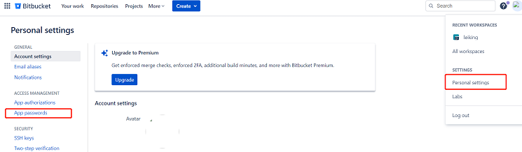
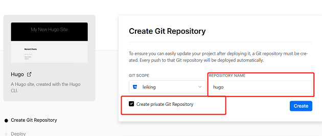
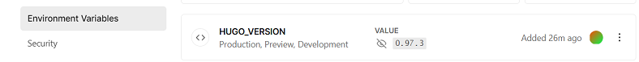

# vercel和git配合搭建个人笔记

1. https://vercel.com/dashboard，应用部署平台，后期用来部署web应用

2. https://bitbucket.org/，git仓库，vercel 部署所需文件来源；可以使用github等

3. bitbucket 设置应用密码 防止拉取代码报错

   

4. vercel 站点绑定 git 仓库，并创建站点，这里使用的是 hugo

   new project --->  Clone Template ---> 选择hugo模板

   

5. 此时 git 仓库已经创建了对应仓库，clone 下来，修改自己的内容，最后 push 上去，vercel 就会自动根据 git 仓库内容重新进行部署

6. bitbucket + vercel + hugo 搭建个人笔记常见错误

   - ```bash
     Error: module "eureka" not found; either add itas a Hugo Module or store it in"/verce1/path0/themes ".: module does not exist
     Error:Command "hugo -D --gc" exited with 255
     ```

     主题问题，将主题文件夹下与git相关的删除

   - ```bash
     Error: add site dependencies: load resources: loading templates: "/vercel/path0/layouts/docs/doc_list.html:3:1": parse failed: template: docs/doc_list.html:3: function "warnf" not defined
     
     Error: Command "hugo -D --gc" exited with 255
     ```

     Hugo版本问题，配置环境变量指定hugo版本；

     HUGO_VERSION    0.97.3

     

# hugo常用方法

## url


> absLangURL

返回带有语言前缀的绝对URL(如果有的话)

```go
// baseURL = https://example.org/
{{ absLangURL "" }}           →   https://example.org/en/

// baseURL = https://example.org/docs/
{{ absLangURL "" }}           →   https://example.org/docs/en/
```


> absURL

返回一个绝对URL

```go
// baseURL = https://example.org/
{{ absURL "" }}           →   https://example.org/

// baseURL = https://example.org/docs/
{{ absURL "" }}           →   https://example.org/docs/
```


> relURL

返回一个相对URL

```go
// baseURL = https://example.org/
{{ relURL "" }}           →   /

// baseURL = https://example.org/docs/
{{ relURL "" }}           →   /docs/
```


> relLangURL

返回带有语言前缀的相对URL(如果有的话)

```go
// baseURL = https://example.org/
{{ relLangURL "" }}           →   /en/

// baseURL = https://example.org/docs/
{{ relLangURL "" }}           →   /docs/en/
```


> relref

返回页面相对永久链接

```go
// baseURL = http://example.org/
{{ relref . "/about" }}  	→  /about/
```


## 条件


> with：会重新绑定上下文，类似于：if something exists, do this

```go
{{ with .Params.title }}
    <h4>{{ . }}</h4>
{{ end }}


{{ with .Param "description" }}
    {{ . }}
{{ else }}
    {{ .Summary }}
{{ end }}
```


> if

```go
{{ if isset .Params "title" }}
    <h4>{{ index .Params "title" }}</h4>
{{ end }}


{{ if (isset .Params "description") }}
    {{ index .Params "description" }}
{{ else if (isset .Params "summary") }}
    {{ index .Params "summary" }}
{{ else }}
    {{ .Summary }}
{{ end }}
```


> `and` & `or`

```go
{{ if (and (or (isset .Params "title") (isset .Params "caption")) (isset .Params "attr")) }}
```


> 比较运算符

```go

le ARG1 ARG2    //  arg1 <= arg2

ge ARG1 ARG2    //  arg1 >= arg2

lt ARG1 ARG2    //  arg1 < arg2

gt ARG1 ARG2    //  arg1 > arg2

eq ARG1 ARG2    //  arg1 == arg2

ne ARG1 ARG2    //  arg1 != arg2
```


## 日期


> Date.AddDate

返回加上给定年月日后的时间

```go
// .AddDate YEARS MONTHS DAYS

{{ $d := "2023-01-31" | time.AsTime }}
{{ $d.AddDate 0 1 0 | time.Format "2006-01-02" }} --> 2023-03-03
```


> Date.Format

格式化时间

```go
/*
	"Monday, January 2, 2006"
	"Mon Jan 2 2006"
	"January 2006"
	"2006-01-02"
	"Monday"
	"02 Jan 06 15:04 MST"
	"02 Jan 06 15:04 -0700"
	"Mon, 02 Jan 2006 15:04:05 MST"
	"Mon, 02 Jan 2006 15:04:05 -0700"
*/
.Date.Format (default "January 2, 2006" .Site.Params.DateFormat)
```


>

# hugo常用变量
