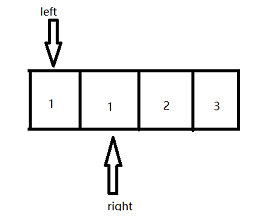
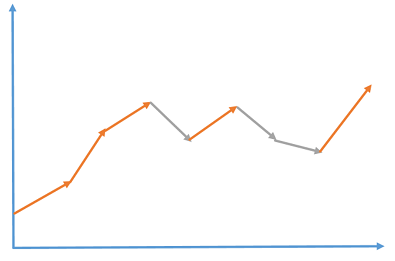

# 删除排序数组中的重复项

## 题目

给你一个 **升序排列** 的数组 `nums` ，原地删除重复出现的元素，使每个元素 **只出现一次** ，返回删除后数组的新长度。元素的 **相对顺序** 应该保持 **一致** 。

示例：

```tex
输入：nums = [1,1,2]
输出：2, nums = [1,2,_]
解释：函数应该返回新的长度 2 ，并且原数组 nums 的前两个元素被修改为 1, 2 。不需要考虑数组中超出新长度后面的元素
```

## 解题思路

采用双指针方式



当`left`的值与`right`的值相等时，移动`right`指向往后一格，`left`指向不变

当`left`指向值和`right`指向值不相等时，移动`left`指向往后一格，并将此时`right`指向的值赋给`left`指向的位置，然后再将`right`指向往后移动一格

最终返回的`left`为不重复元素数组大小，返回`left+1`为不重复元素个数

## 代码

```java
public static int removeDuplicates(int[] nums) {
    if (nums==null||nums.length==0){
        return 0;
    }
    int left=0;
    //for循环移动right指向位置
    for (int right=0;right<nums.length;right++){
        if (nums[left]!=nums[right]){
            //移动left指向位置
            nums[++left]=nums[right];
        }
    }
    return left+1;
}
```

# 买卖股票的最佳时机

## 题目

给定一个数组 prices ，其中 prices[i] 表示股票第 i 天的价格。

在每一天，你可能会决定购买和/或出售股票。你在任何时候最多 只能持有 一股股票。你也可以购买它，然后在 同一天 出售。
返回你能获得的最大利润

示例：

```tex
示例一：
输入: prices = [7,1,5,3,6,4]
输出: 7
解释: 在第 2 天（股票价格 = 1）的时候买入，在第 3 天（股票价格 = 5）的时候卖出, 这笔交易所能获得利润 = 5-1 = 4 。随后，在第 4 天（股票价格 = 3）的时候买入，在第 5 天（股票价格 = 6）的时候卖出, 这笔交易所能获得利润 = 6-3 = 3
     
示例二：
输入: prices = [1,2,3,4,5]
输出: 4
解释: 在第 1 天（股票价格 = 1）的时候买入，在第 5 天 （股票价格 = 5）的时候卖出, 这笔交易所能获得利润 = 5-1 = 4 。注意你不能在第 1 天和第 2 天接连购买股票，之后再将它们卖出。因为这样属于同时参与了多笔交易，你必须在再次购买前出售掉之前的股票。
```

## 解题思路

**动态规划解决**

当日最大利益存在两种情况：

1. 手里不存在股票

   1. 当天进行过交易，手里股票卖出，此时的利益为前一天手里持有股票的利益和当天价格之和
   2. 当天没有进行过交易，又因为当天手里没有股票，所以当天没有股票的利润只能取前一天手里没有股票的利润

   取上述两种条件的利益最大值：Max(noHold[i-1],hold[i-1]+price[i])

2. 手里存在股票

   1. 当天进行过买入，那么利益为前一天无股票利益减去当天价格
   2. 当天没进行过买入，那么利益为前一天持有股票的利益
   3. Max(noHold[i-1]-price[i],hold[i-1])

递推公式出来了，临界条件应该为第一天，此时：

1. 如果第一天未买入为：noHold=0
2. 如果第一天买入：hold=-price[1]

伪代码如下

```tex
int[] noHold=new int[price.length]; //没持有股票
int[] hold=new int[price.length]; //持有股票
noHold[0]=0;	//临界条件
hold[0]=-price[0];	//临界条件
for (int i=1;i<price.length;i++){
    noHold[i]=Math.max(noHold[i-1],hold[i-1]+price[i]);
    hold[i]=Math.max(noHold[i-1]-price[i],hold[i-1]);
}
//最大利润取手里没股票的最后一天的利润肯定是最大的
return noHold[noHold.length-1];
```

**贪心算法解决**

如下图所示：股票上涨的最大值和开始上涨先最小值之间的差，就为该段时间内股票的最大利益；如果是股票下跌则不进行计算；最后把所有上涨时间段的利益相加就是最大利益




## 代码

**动态规划解决代码**

```java
public static int maxProfit(int[] price) {
    if (price==null||price.length<2){
        return 0;
    }
    int noHold=0;   //第一天没持有股票
    int hold=-price[0];  //第一天持有股票
    for (int i=1;i<price.length;i++){
        noHold=Math.max(noHold,hold+price[i]);
        hold=Math.max(noHold-price[i],hold);
    }
    return noHold;
}
```

**贪心算法解决代码**

```java
public static int maxProfit(int[] price) {
    if (price==null||price.length<2){
        return 0;
    }
    int total=0; int index=0; int length=price.length;
    while (index<length-1){
        //如果股票下跌就一直找，直到找到股票开始上涨为止
        while (index<(length-1)&&price[index]>=price[index+1]){
            index++;
        }
        //股票上涨开始的值，也就是这段时间上涨的最小值
        int min = price[index];
        //一直找到股票上涨的最大值为止
        while (index<(length-1)&&price[index]<=price[index+1]){
            index++;
        }
        //计算这段上涨时间的差值，然后累加
        total+=price[index]-min;
    }
    return total;
}

//优化后代码如下
public static int maxProfit(int[] price) {
    if (price==null||price.length<2){
        return 0;
    }
    int total=0;
    for (int i = 0; i < price.length - 1; i++) {
        //原数组中如果后一个减去前一个是正数，说明是上涨的，
        //我们就要累加，否则就不累加
        total += Math.max(price[i + 1] - price[i], 0);
    }
    return total;
}
```

# 旋转数组

## 题目

给你一个数组，将数组中的元素向右轮转 `k` 个位置，其中 `k` 是非负数。

示例：

```tex
输入: nums = [1,2,3,4,5,6,7], k = 3
输出: [5,6,7,1,2,3,4]
解释:
向右轮转 1 步: [7,1,2,3,4,5,6]
向右轮转 2 步: [6,7,1,2,3,4,5]
向右轮转 3 步: [5,6,7,1,2,3,4]
```

## 解题思路

**使用临时数组**

**多次旋转**

**环形旋转**

## 代码

**使用临时数组**

```java

```

**多次旋转**


