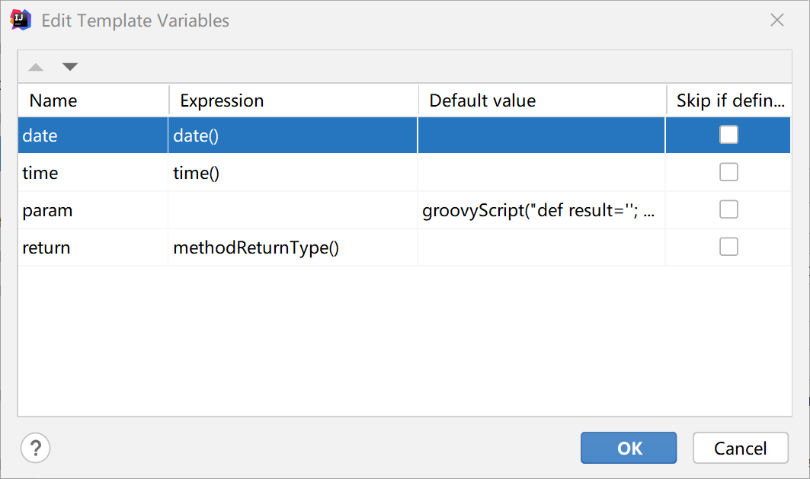
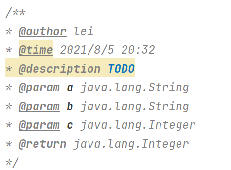

# java方法注释模板

1. 添加一个`Live Templates`

   `File | Settings | Editor | Live Templates`   右侧 `+`号，添加`Live Group` 然后添加 `Live Templates`

2. 设置Template text 如下

   ```java
   **
   * @author lei
   * @time $date$ $time$
   * @description TODO
   $param$
   * @return $return$
   */
   ```

3. `Edit variables`设置变量值

   

4. param `Default value`内容为：

   ```
   groovyScript("def result=''; def params=\"${_1}\".replaceAll('[\\\\[|\\\\]|\\\\s]', '').split(',').toList(); for(i = 0; i < params.size(); i++) {result+='* @param ' + params[i] + ((i < params.size() - 1) ? '\\r\\n' : '')}; return result", methodParameters())
   ```

5. 设置快捷生成方法 ,Tab、Enter ...

6. 扩展

   ```
   // params=methodParameters()
   // date=date()
   // 第一个参数脚本，可以指定为本地地址的groovyScript
   groovyScript("def params=${_1}; def date=${_2}", methodParameters(),date())
   ```

   ```
   // 可以生成如下方法注释
   groovyScript("def result=''; def params=\"${_1}\".replaceAll('[\\\\[|\\\\]|\\\\s]', '').split(',').toList();def types=\"${_2}\".replaceAll('[\\\\[|\\\\]|\\\\s]', '').split(',').toList();for(i = 0; i < params.size(); i++){result+='* @param '  + params[i] + ' ' + types[i] + ((i < params.size() - 1) ? '\\r\\n' : '')};return result", methodParameters(),methodParameterTypes())
   ```

   

7. 建议使用 `EasyJavadoc` 插件

# 必装插件

1. Easy Javadoc：快捷生成注释，默认快捷键`ctrl+\`
2. Free MyBatis plugin ：直接从dao定位到对应的mapper，检测dao方法
3. Vue.js ：支持vue开发
4. Jrelbel：热部署插件；`http://jrebel.cicoding.cn/1333337d-0999-4f6c-94e0-e1e3971db65b`
