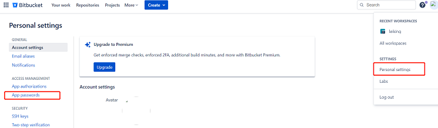
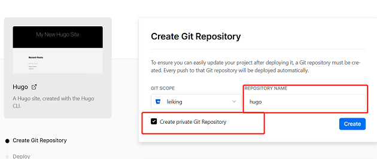
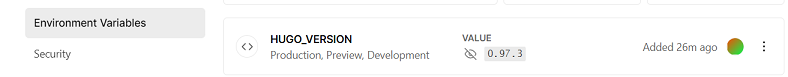

# vercel和git配合搭建个人笔记

1. https://vercel.com/dashboard，应用部署平台，后期用来部署web应用

2. https://bitbucket.org/，git仓库，vercel 部署所需文件来源；可以使用github等

3. bitbucket 设置应用密码 防止拉取代码报错

   

4. vercel 站点绑定 git 仓库，并创建站点，这里使用的是 hugo

   new project --->  Clone Template ---> 选择hugo模板

   

5. 此时 git 仓库已经创建了对应仓库，clone 下来，修改自己的内容，最后 push 上去，vercel 就会自动根据 git 仓库内容重新进行部署

6. bitbucket + vercel + hugo 搭建个人笔记常见错误

   - ```bash
     Error: module "eureka" not found; either add itas a Hugo Module or store it in"/verce1/path0/themes ".: module does not exist
     Error:Command "hugo -D --gc" exited with 255
     ```

     主题问题，将主题文件夹下与git相关的删除

   - ```bash
     Error: add site dependencies: load resources: loading templates: "/vercel/path0/layouts/docs/doc_list.html:3:1": parse failed: template: docs/doc_list.html:3: function "warnf" not defined
     
     Error: Command "hugo -D --gc" exited with 255
     ```

     Hugo版本问题，配置环境变量指定hugo版本；

     HUGO_VERSION    0.97.3

     

